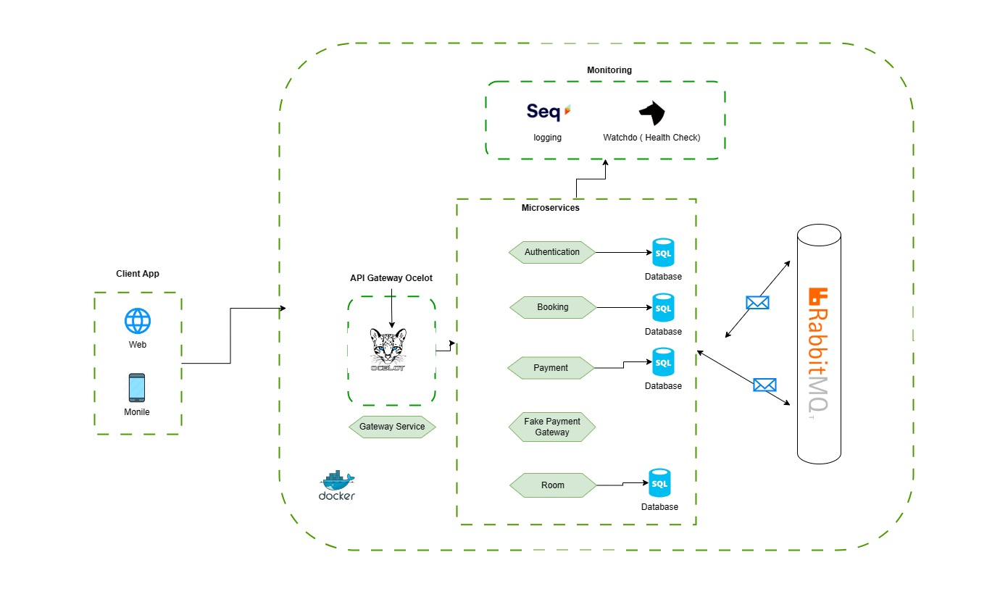

# Microservices Smaer Hotel System with MassTransit and RabbitMQ

## Overview

This project demonstrates the implementation of a microservices-based hotel booking system using .NET Core, MassTransit, and RabbitMQ. The system follows a saga pattern to orchestrate the workflow involving booking creation, payment processing, availability updates, and booking status updates.

## Architecture
  

## :hearts: Technical stacks

- ✔️ **[`.NET Core 8`](https://dotnet.microsoft.com/download)** - .NET Framework and .NET Core, including ASP.NET and ASP.NET Core
- ✔️ **[`MediatR`](https://github.com/jbogard/MediatR)** - Simple, unambitious mediator implementation in .NET
- ✔️ **[`FluentValidation`](https://github.com/FluentValidation/FluentValidation)** - Popular .NET validation library for building strongly-typed validation rules
- ✔️ **[`serilog`](https://github.com/serilog/serilog)** - Simple .NET logging with fully-structured events
- ✔️ **[`Ocelot`](https://github.com/ThreeMammals/Ocelot)** - Ocelot is an open-source API Gateway, designed for microservices architecture.
- ✔️ **[`AutoMapper`](https://automapper.org/)** - AutoMapper is a simple library that helps us to transform one object type into another.
- ✔️ **[`EF Core`](https://github.com/dotnet/efcore)** - Modern object-database mapper for .NET. It supports LINQ queries, change tracking, updates, and schema migrations
- ✔️ **[`Polly`](https://github.com/App-vNext/Polly)** - Polly is a .NET resilience and transient-fault-handling library that allows developers to express policies such as Retry, Circuit Breaker, Timeout, Bulkhead Isolation, and Fallback in a fluent and thread-safe manner
- ✔️ **[`RabbitMQ`](https://automapper.org)** - RabbitMQ is an open-source message-broker
- ✔️ **[`MassTransit`](https://masstransit.io/)** - MassTransit provides a developer-focused, modern platform for creating distributed applications without complexity.

  

## Features
 **Booking Service:**  Manages the booking lifecycle, orchestrates workflows using MassTransit and RabbitMQ, and implements the Saga pattern for state transitions. Collaborates with Payment and Availability Services.

**Payment Service:** Processes payments asynchronously, communicates with external gateways, and updates the Booking Service with payment statuses, ensuring seamless integration within the booking ecosystem. 

**Availability Service:** Manages real-time room availability updates based on bookings from the Booking Service, fostering an accurate representation of room status and communicating updates to support timely decision-making.

**Authentication Service:** Ensures system security by managing user authentication, validating credentials, and providing authentication tokens for secure operations, safeguarding against unauthorized access.
    
## ⭐ Give a star
If you're using this repository for your learning, samples, workshop, or your project, please give a star. Thanks :+1:

## Setup and Usage

1. Clone the repository:
   git clone https://github.com/yourusername/microservices-booking-system.git
