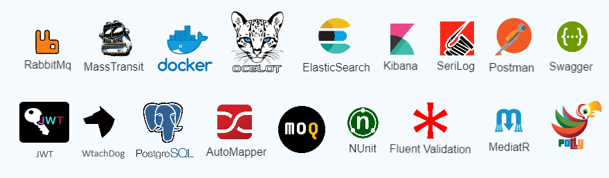

# Microservices Smaer Hotel System with MassTransit and RabbitMQ

## Overview

This project demonstrates the implementation of a microservices-based booking system using .NET Core, MassTransit, and RabbitMQ. The system follows a saga pattern to orchestrate the workflow involving booking creation, payment processing, availability updates, and booking status updates.
## Tech Stack
  
## Features

- **Booking Service:**
  - Manages the booking process.
  - Orchestrates the workflow using MassTransit and RabbitMQ.
  - Saga pattern implementation to handle state transitions.

- **Payment Service:**
  - Processes payments asynchronously.
  - Communicates with external payment gateways.
  - Sends payment status updates to the Booking Service.

- **Availability Service:**
  - Manages room availability.
  - Updates availability based on bookings.
  - Sends availability status updates to the Booking Service.

- **Authentication Service:**
  - Manages user authentication.
  - Provides authentication tokens for secured operations.

## :hearts: Technical stacks

- ✔️ *[`.NET Core 6`](https://dotnet.microsoft.com/download)** - .NET Framework and .NET Core, including ASP.NET and ASP.NET Core
- ✔️ **[`MVC Versioning API`](https://github.com/microsoft/aspnet-api-versioning)** - Set of libraries which add service API versioning to ASP.NET Web API, OData with ASP.NET Web API, and ASP.NET Core
- ✔️ **[`YARP`](https://github.com/microsoft/reverse-proxy)** - A toolkit for developing high-performance HTTP reverse proxy applications
- ✔️ **[`MediatR`](https://github.com/jbogard/MediatR)** - Simple, unambitious mediator implementation in .NET
- ✔️ **[`EF Core`](https://github.com/dotnet/efcore)** - Modern object-database mapper for .NET. It supports LINQ queries, change tracking, updates, and schema migrations
- ✔️ **[`FluentValidation`](https://github.com/FluentValidation/FluentValidation)** - Popular .NET validation library for building strongly-typed validation rules
- ✔️ **[`Swagger & Swagger UI`](https://github.com/domaindrivendev/Swashbuckle.AspNetCore)** - Swagger tools for documenting API's built on ASP.NET Core
- ✔️ **[`serilog`](https://github.com/serilog/serilog)** - Simple .NET logging with fully-structured events
- ✔️ **[`Dapr dotnet-sdk`](https://github.com/dapr/dotnet-sdk)** - Dapr SDK for .NET
- ✔️ **[`RestEase`](https://github.com/canton7/RestEase)** - Easy-to-use typesafe REST API client library for .NET Standard 1.1 and .NET Framework 4.5 and higher, which is simple and customisable
- ✔️ **[`Polly`](https://github.com/App-vNext/Polly)** - Polly is a .NET resilience and transient-fault-handling library that allows developers to express policies such as Retry, Circuit Breaker, Timeout, Bulkhead Isolation, and Fallback in a fluent and thread-safe manner
- ✔️ **[`Scrutor`](https://github.com/khellang/Scrutor)** - Assembly scanning and decoration extensions for Microsoft.Extensions.DependencyInjection
- ✔️ **[`opentelemetry-dotnet`](https://github.com/open-telemetry/opentelemetry-dotnet)** - The OpenTelemetry .NET Client
- ✔️ **[`Blazor - WASM`](https://dotnet.microsoft.com/apps/aspnet/web-apps/blazor)** - Client web apps with C#
- ✔️ **[`BFF`](https://github.com/DuendeSoftware/BFF)** - Framework for ASP.NET Core to secure SPAs using the Backend-for-Frontend (BFF) pattern
- 
## ⭐ Give a star
If you're using this repository for your learning, samples, workshop, or your project, please give a star. Thanks :+1:

## Setup and Usage

1. Clone the repository:
   git clone https://github.com/yourusername/microservices-booking-system.git
