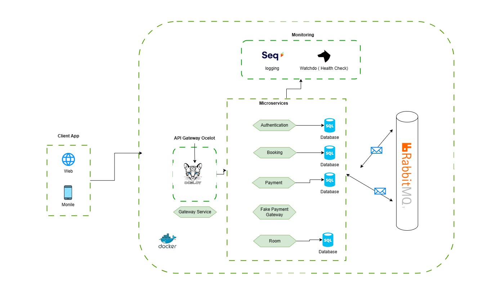
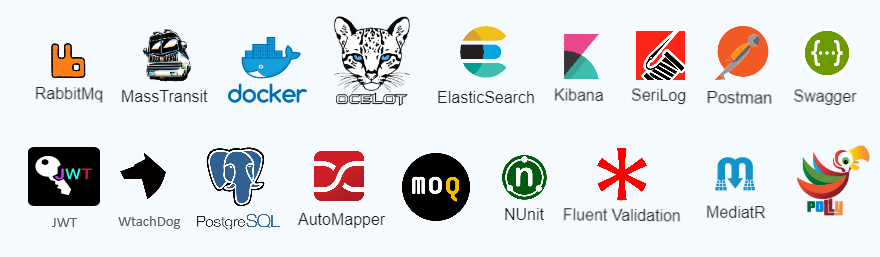

# .NET CORE 8.0 Microservices Boilerplate

## Overview

Explore the SmartHotel Booking System, a comprehensive showcase illustrating the power of microservices architecture. This project, crafted with simplicity and efficiency in mind, demonstrates the orchestration of a hotel booking workflow through a series of modular microservices.

If you find this project useful, please give it a star. Thanks! ⭐

## Pattern, C#12 and .NET Core 8 features.

|   |    |   |
|---|---|---|
| Built on .NET 8.0  |Follows Clean Architecture Principles   | Docker-Compose File Examples  |
| Global Error Handling  |Uses Entity Framework Core as DB Abstraction   |Global using |
| Fluent Validation and a Validation Pipeline Behaviour on top of MediatR  |JWT Authentication   |CQRS implementation with MediatR library |
|API Versioning  |Uses Entity Framework Core as DB Abstraction   |Minimal API for all endpoints. |
|Rabbitmq on top of MassTranit for Event Driven Architecture between our microservices.  |Health Check for reporting the health of app infrastructure components.   |Ocelot as a microservices gateway. |
 

 
 
   

## Architecture
  

## :hearts: Technical stacks

- ❇️ **[`.NET Core 8`](https://dotnet.microsoft.com/download)** - .NET Framework and .NET Core, including ASP.NET and ASP.NET Core
- ❇️ **[`MediatR`](https://github.com/jbogard/MediatR)** - Simple, unambitious mediator implementation in .NET
- ❇️ **[`FluentValidation`](https://github.com/FluentValidation/FluentValidation)** - Popular .NET validation library for building strongly-typed validation rules
- ❇️ **[`serilog`](https://github.com/serilog/serilog)** - Simple .NET logging with fully-structured events
- ❇️ **[`Ocelot`](https://github.com/ThreeMammals/Ocelot)** - Ocelot is an open-source API Gateway, designed for microservices architecture.
- ❇️ **[`AutoMapper`](https://automapper.org/)** - AutoMapper is a simple library that helps us to transform one object type into another.
- ❇️ **[`EF Core`](https://github.com/dotnet/efcore)** - Modern object-database mapper for .NET. It supports LINQ queries, change tracking, updates, and schema migrations
- ❇️ **[`Polly`](https://github.com/App-vNext/Polly)** - Polly is a .NET resilience and transient-fault-handling library that allows developers to express policies such as Retry, Circuit Breaker, Timeout, Bulkhead Isolation, and Fallback in a fluent and thread-safe manner
- ❇️ **[`RabbitMQ`](https://automapper.org)** - RabbitMQ is an open-source message-broker
- ❇️ **[`MassTransit`](https://masstransit.io/)** - MassTransit provides a developer-focused, modern platform for creating distributed applications without complexity.
- ❇️ **[`Mog`](https://github.com/devlooped/moq)** - The most popular and friendly mocking library for .NET.
- ❇️ **[`NUite`](https://nunit.org/)** - NUnit is a unit-testing framework for all .Net languages.

  

## Features
 **Booking Service:**  Manages the booking lifecycle, orchestrates workflows using MassTransit and RabbitMQ, and implements the Saga pattern for state transitions. Collaborates with Payment and Availability Services.

**Payment Service:** Processes payments asynchronously, communicates with external gateways, and updates the Booking Service with payment statuses, ensuring seamless integration within the booking ecosystem. 

**Availability Service:** Manages real-time room availability updates based on bookings from the Booking Service, fostering an accurate representation of room status and communicating updates to support timely decision-making.

**Authentication Service:** Ensures system security by managing user authentication, validating credentials, and providing authentication tokens for secure operations, safeguarding against unauthorized access.

##  Todo Items
- API version ✔️
- Saga Orchestration using MassTransit
- Infrastructure project to deploy Azure AKS
- Reduce a Significant part of code by using Primary Constructors.
- Add unit testing proejct for all services.

## Authors

If you have any questions or need further assistance, please contact the project author at **[`LinkedIn`](https://www.linkedin.com/in/askarmus/)**

## Contributing

Feel free to contribute to this project! Share your ideas, bug fixes, or improvements by opening an issue or submitting a pull request. Your input is valuable and helps enhance the project.

## License

This project is licensed under the [MIT License](LICENSE).
